# LightBee Display

A dashboard for the Sur-Ron e-bike built on a Guition JC3248W535 (ESP32-S3,
16MB flash, 8MB OPI PSRAM, 480x320 touch display).

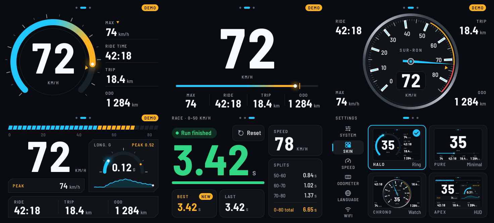

## Screenshots

Captured from the device's framebuffer (480x320, demo data).

| | |
|---|---|
| 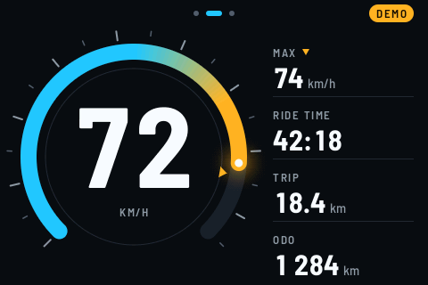 **HALO** — ring gauge | 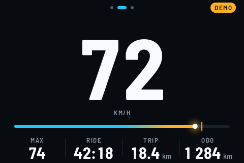 **PURE** — minimal hero number |
| 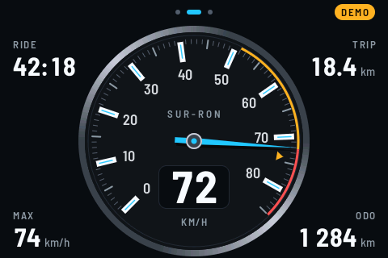 **CHRONO** — analog dial | 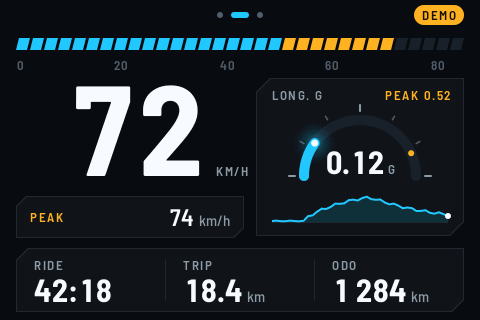 **APEX** — track HUD with G meter |
| 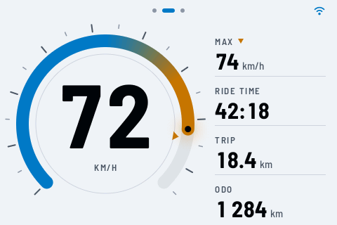 Light (sunlight) theme | 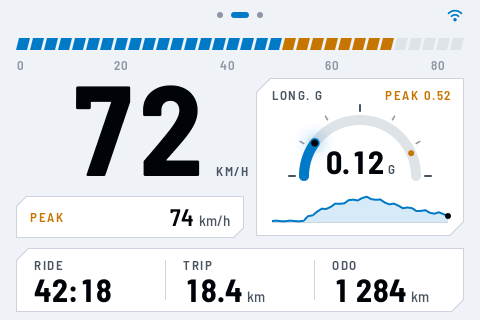 APEX, light theme |
| 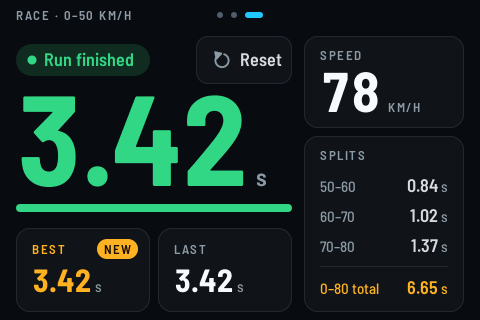 0-50 km/h race timer with splits | 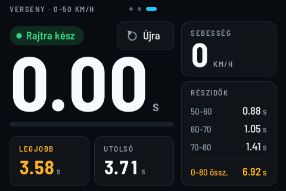 Race timer ready (Hungarian UI) |
| 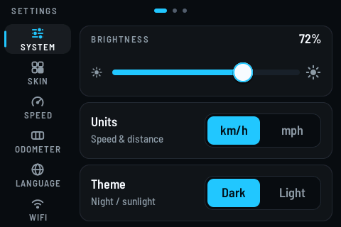 Settings: brightness, units, theme | 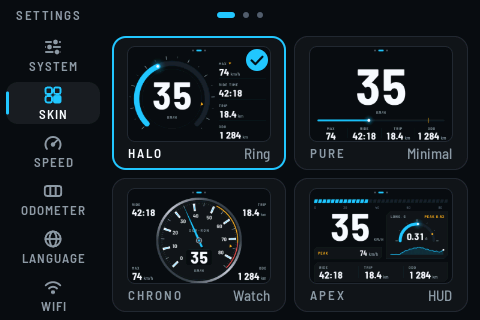 Settings: skin picker |

## Features

- 4 anti-aliased gauge skins: HALO (ring gauge), PURE (minimal hero number), CHRONO (analog dial), APEX (track HUD with G meter)
- Dark and light (sunlight) themes, designed in `design/` (mockups + spec)
- Race timer: 0-50 km/h with split times
- English / Hungarian UI
- On-device settings (units, speed calibration, filtering, brightness, etc.)
- **New:** web-based OTA firmware updates — no laptop or USB cable needed

## Hardware

- Board: Guition JC3248W535 (ESP32-S3, 16MB flash, 8MB OPI PSRAM, 480x320 touch LCD)
- Speed sensor input: GPIO17

## Arduino IDE board settings

| Setting              | Value                                      |
|----------------------|---------------------------------------------|
| Board                | ESP32S3 Dev Module                          |
| Flash Size           | 16MB                                        |
| Partition Scheme     | 16M Flash (3MB APP/9.9MB FATFS)             |
| PSRAM                | OPI PSRAM                                   |
| USB CDC On Boot      | Enabled                                     |

These correspond to the FQBN used by CI and `build.ps1`:

```
esp32:esp32:esp32s3:FlashSize=16M,PartitionScheme=app3M_fat9M_16MB,PSRAM=opi,CDCOnBoot=cdc
```

## Required libraries

Install these via the Arduino IDE Library Manager unless noted otherwise:

- **GFX Library for Arduino** (moononournation/Arduino_GFX) — pin to **1.6.6**
- **Adafruit GFX Library**
- **Adafruit BusIO**
- **JPEGDecoder** (Bodmer)
- **JC3248W535EN-Touch-LCD** — *not* in the Library Manager. Install from
  GitHub: https://github.com/AudunKodehode/JC3248W535EN-Touch-LCD
  (Sketch → Include Library → Add .ZIP Library, or clone it into your
  `libraries` folder.)

## First-time setup / flashing over USB

The sketch ships a custom `Main/partitions.csv` (two 3MB OTA app slots, same
layout as the core's "16M Flash (3MB APP/9.9MB FATFS)" scheme) so that OTA
updates have somewhere to write the new firmware. **The very first time you
install LightBee Display on a device — or after this partition table changes —
you must flash over USB once.** Use a normal upload (Arduino IDE Upload
button or `.\build.ps1 -Upload -Port COMx`): it writes the bootloader,
partition table and app but leaves NVS (0x9000) alone, so your odometer and
saved settings are preserved. Don't use the `-full.bin` for this — it wipes
NVS.

After that first USB flash, every later update can be done over WiFi (see
below).

## Updating firmware over WiFi (OTA)

The dashboard can run a temporary WiFi hotspot and a small web page for
uploading a new firmware image — no PC required.

1. **On your phone, download the new firmware `.bin` before you turn on the
   hotspot.** The dashboard's update hotspot has no internet access, so grab
   the file from the project's GitHub Releases page first:
   `Main/version.h` → `FW_RELEASES_URL`. Download the file named
   `LightBeeDisplay-<version>.bin` (**not** the `-full.bin` one).
2. Make sure the bike is stationary — the updater refuses to start while it
   detects motion.
3. On the dashboard, go to **Settings → WIFI** and turn on the update
   hotspot. The screen shows the network name (`LightBeeDisplay-XXXX`), a
   password, and a QR code.
4. On your phone, scan the QR code to join the hotspot (or join manually with
   the shown SSID/password). Most phones will pop up a captive-portal page
   automatically; if not, open a browser and go to `http://192.168.4.1`.
5. Tap **Choose file**, select the `.bin` you downloaded in step 1, then tap
   **Install**.
6. Wait for the upload and flash to finish — the device reboots on its own
   when done. Don't power off the bike during this step.

Notes:
- The hotspot turns itself off automatically after about 10 minutes of
  inactivity to save power/avoid leaving WiFi open.
- The update hotspot is local-only; it does not provide internet access to
  your phone while connected.

## Publishing a release (for maintainers)

1. Bump `FW_VERSION` in `Main/version.h`.
2. Commit the change.
3. Tag and push:
   ```
   git tag v4.1.0
   git push --tags
   ```
4. `.github/workflows/release.yml` builds the firmware, checks that the tag
   matches `FW_VERSION`, and publishes a GitHub Release with:
   - `LightBeeDisplay-<version>.bin` — for the web OTA updater
   - `LightBeeDisplay-<version>-full.bin` — full recovery image for USB flashing
     at `0x0` (erases settings/odometer)
   - `LightBeeDisplay-<version>.bin.md5` and `SHA256SUMS.txt` — checksums

You can also trigger the workflow manually (Actions → Build and Release
Firmware → Run workflow) to get a build as a downloadable artifact without
creating a release; this skips the tag/version check.

### Local build

`build.ps1` builds the same way CI does, using the arduino-cli bundled with
the Arduino IDE (or one on your PATH):

```powershell
.\build.ps1
```

It prints the firmware version and the paths of the OTA `.bin` and the full
merged `.bin`, both under `.\build`. To also flash over USB:

```powershell
.\build.ps1 -Upload -Port COM5
```

## Troubleshooting

- **"Invalid file" / update rejected** — you likely uploaded
  `LightBeeDisplay-<version>-full.bin`. Use the plain
  `LightBeeDisplay-<version>.bin` for the web updater; the `-full.bin` is only
  for USB flashing at offset `0x0`.
- **"Bike moving" / update refused** — park the bike and make sure it's
  fully stationary, then retry.
- **Upload fails partway / times out** — WiFi range issue. Move your phone
  closer to the dashboard and retry; avoid other heavy WiFi traffic nearby.
- **Device won't boot after an update** — first try a normal USB upload
  from the Arduino IDE / `build.ps1 -Upload` (keeps the odometer). If that
  fails too, flash `LightBeeDisplay-<version>-full.bin` at offset `0x0` with
  esptool (`esptool --chip esp32s3 write-flash 0x0 <file>`); note this
  resets settings and the odometer.
- **Hotspot turned off before I finished** — it auto-disables after ~10
  minutes idle. Just turn it back on in Settings → WIFI and retry.

## Releases

Firmware builds are published at
https://github.com/eng4t3/SurronLightBeeDisplay/releases/latest
(`FW_RELEASES_URL` in `Main/version.h`; the web updater links there).
